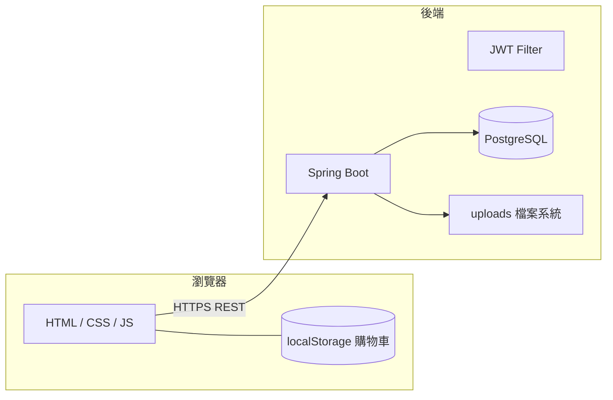

# Sogno di Casa（FORMA）電商站 — 架構與換皮指引

**文件目的**：讓產品、設計、工程在**不改核心商業與資料流程**的前提下，更換品牌（換皮）、重做主視覺或遷移部署時，有**同一份**可依循的邊界說明。  
**產出視角**：資深營運／技術決策 — 區分「**契約層（應凍結）**」與「**表現層（可替換）**」。

---

## 1. 一句話架構

本專案為 **無框架多頁靜態前端（HTML + CSS + 原生 JS）**，透過 **REST API** 連接 **Spring Boot 3 + JPA + PostgreSQL**；會員與後台管理使用 **JWT（Bearer）**；購物車暫存於 **瀏覽器 localStorage**，結帳時寫入後端訂單。



---

## 2. 換皮策略總覽（給決策者）

| 層級 | 建議作法 | 風險若忽略 |
|------|----------|------------|
| **品牌與文案** | 替換各頁 `<title>`、標語、頁尾版權、按鈕文字；維持 **URL 結構**（`products.html`、`product-detail.html?id=`）可降低行銷與書籤失效。 | 僅改圖不改字易造成品牌不一致。 |
| **視覺（UI）** | 以 **`style.css` 的 CSS 變數**（如 `--color-*`, `--font-*`）為主軸換色與字型；組件 class（如 `.forma-nav`, `.btn-forma`）可逐步改名但需全域替換。 | 直接在 HTML 內聯大量樣式會讓第二次換皮成本倍增。 |
| **圖像資產** | 列表／詳情主圖以 **後台 `mainImage` + `galleryJson`** 或 URL 指向 CDN；首頁輪播與裝飾圖為 **HTML/CSS 背景** 時需逐頁替換。 | 圖檔路徑散落於 `pics/`、`product-images.js`、API 三處時，需列清單避免漏改。 |
| **資料與 API** | **保留 JSON 欄位語意**（商品、訂單、使用者）與端點路徑，前端即可替換為新版型或改為 SPA，而後端可沿用。 | 任意更名 API 或欄位需同步改版所有前端與行動端。 |

**核心原則**：換皮時優先動 **表現層（CSS、圖、文案）**；**契約層（REST 形狀、資料表語意、JWT 流程）** 應視為產品資產，變更需走版本與迴歸測試。

---

## 3. 領域模型（Domain）— 團隊共識用語

| 領域物件 | 說明 | 持久化 |
|----------|------|--------|
| **會員（User）** | 姓名、Email（登入帳號）、密碼雜湊、角色 `USER` / `ADMIN` | `users` |
| **商品（Product）** | 名稱、品牌、分類、價格、描述、主圖 URL、`galleryJson` 多圖／顏色、是否可購 | `products` |
| **訂單（Order）** | 屬於一會員、總金額、建立時間；含多筆明細 | `orders` |
| **訂單明細（OrderItem）** | 快照：品名、品牌、單價、數量、選配顏色／木材；`productId` 僅參考用 | `order_items` |

**商業規則備註（實作現狀）**：

- 價格與稅運：前端購物車頁計算運費、稅與折扣後送 `total`；後端**未重算驗證**，換皮或接金流時若需防篡改，應在後端補強。
- 庫存：`inStock` 存在但購物流程未必強制檢查，屬可擴充點。

---

## 4. 資料模型精要（工程實作）

### 4.1 實體關係（概念）

```
User 1 ──< Order 1 ──< OrderItem*
Product (獨立表；訂單明細以快照欄位保存，非 FK 強綁)
```

### 4.2 商品 `galleryJson`（與前端一致）

後端以 **TEXT** 存 JSON 字串。建議每筆物件包含：

- `thumb` / `full`：縮圖與大圖 URL（必填語意上至少一張可顯示）。
- `color`（選填）：若有，詳情頁可產生顏色選擇器與對應圖。

詳見附錄 [INVENTORY-TECHNICAL.md](./INVENTORY-TECHNICAL.md)。

---

## 5. API 契約（換皮時應視為穩定介面）

所有公開與需登入端點、HTTP 方法、認證方式已整理於 **INVENTORY-TECHNICAL.md §1**。

**換皮／前端重寫時最低限度相容**：

1. `GET /api/products`、`GET /api/products/{id}`：不需登入。  
2. `POST /api/auth/login`、`register`：取得 JWT 與 `role`。  
3. `POST /api/orders`、`GET /api/orders`：需 Bearer；訂單列表 JSON 結構固定為前端 `account.html` 所用。

**管理員**：`ROLE_ADMIN`；商品 CUD 與圖片上傳需對應角色。

---

## 6. 前端結構與「換皮工作包」

### 6.1 頁面地圖（使用者動線）

| 動線 | 頁面 | 資料來源 |
|------|------|----------|
| 逛商品 | `products.html` | API 為主 |
| 看詳情 | `product-detail.html` | API 為主；離線 fallback 為內嵌靜態陣列 |
| 購物車 | `cart.html` | localStorage |
| 登入／註冊 | `login.html` | API |
| 我的訂單 | `account.html` | API |
| 後台 | `admin.html` | API + 上傳 |

### 6.2 換皮時建議修改的檔案類型

| 類型 | 檔案／位置 | 備註 |
|------|------------|------|
| 全域視覺 | `style.css` | **優先**集中調整變數與共用 class |
| 版型片段 | 各 `*.html` | Navbar、Footer、輪播區塊 |
| 腳本中的品牌字串 | `auth.js`（導覽列）、各頁 title | 搜尋 `FORMA` 批次替換 |
| 後台／API 網址 | `auth.js` 的 `API_BASE`、`admin.js`、`account.html` 內嵌 URL | 部署必改；建議統一由單一設定注入 |

### 6.3 與「資料驅動」並存的靜態覆寫

- **`product-images.js`**：以 `PRODUCT_IMAGE_MAP` 覆寫特定 `id` 的圖，**不需後端**即可調整展示；與 API 並存時，以 **API 優先** 的頁面為準（列表／詳情載入成功時）。

---

## 7. 配置與部署（換環境必查）

| 項目 | 說明 |
|------|------|
| **CORS** | `cors.allowed-origins` 必須包含正式前端網域。 |
| **上傳圖 URL** | `ProductController.uploadImage` 目前回傳 localhost 形式；上線需改為實際網域或改由物件儲存回傳 CDN URL。 |
| **JWT 密鑰** | `jwt.secret` 正式環境必須更換且保密。 |
| **資料庫** | `ddl-auto=update` 僅宜開發；正式建議 `validate` / migration 工具。 |

---

## 8. 技術債與一致性（換皮專案可順手排）

1. **`API_BASE` 分散**：`auth.js`、`admin.js` 與 `account.html` 內嵌 URL 不一致風險 — 建議單一 `config.js` 或建置時替換。  
2. **詳情頁雙資料源**：`detail.js` 同時含硬編碼 `PRODUCTS_DATA` 與 API — 換皮後應以 **僅 API + 設計稿** 為目標，降低維護兩套。  
3. **OrderItem.productId 型別**：Java 為 `Integer`，商品主鍵為 `Long`，長期應統一。  

---

## 9. 文件維護

- **技術附錄**（端點、localStorage、設定鍵）： [INVENTORY-TECHNICAL.md](./INVENTORY-TECHNICAL.md)  
- 程式重大變更（新增欄位、新 API）時，請同步更新本文件與附錄，避免「換皮文件」與實作脫節。

---

**版本**：依專案現況盤點（Spring Boot 3.2、Java 17、PostgreSQL）。  
